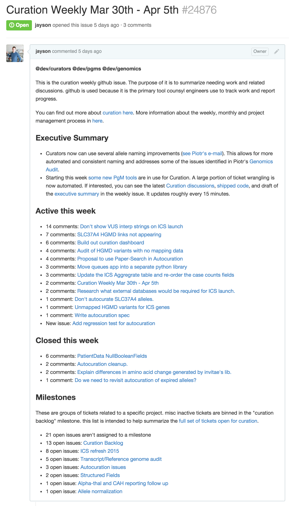
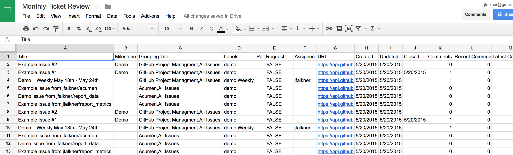

Github Project Management (:octocat: :snake: :tada:)
===

If you work with engineering teams that rely on GitHub and you have to help do project management, these tools are likely helpful. You'll find here a tool that makes weekly summaries of active GitHub issues and a way to export the full list of current GitHub projects based on labels.ma

- [Why make this project?](#why-make-this-project)
- [Don't you know about XYZ and that it does all this and more?](#dont-you-know-about-xyz-and-that-it-does-all-this-and-more)
- [Installing](#installing)
- Example Code
  - [Weekly GitHub summary](#weekly-github-summary)
  - [Export the list of open GitHub issues as a spreadsheet](#export-the-list-of-open-github-issues-as-a-spreadsheet)

This code is maintained by Jayson Falkner (jfalkner@gmail.com). Please file
ideas for improvements in the [issues section](https://github.com/jfalkner/github_project_management/issues) of this repo.

Why make this project?
---

This code came from a need to help better communicate between user groups, engineering resources, management and execs. GitHub is great for tracking source-code changes and the work queue of related engineering tasks. It also allows for direct user participation in discussions. A challenge is that not everyone has the time or interest to follow all GitHub chatter. Fortunately, GitHub has a great API. The goal of this work is to provide a few easy to use tools that enable a project manager to wrangle GitHub issues and focus on related communication with users, devs, and execs.

Here are the tools. No need to be a programmer. If you have a GitHub login, you should be set.

1. [Weekly activity summary](#weekly-github-summary), including manually curated "executive summary" style comments. Useful to quickly see what is going on during the week and bubble up communication appropriately.

2. [Export the list of open GitHub issues as a spreadsheet](#export-the-list-of-open-github-issues-as-a-spreadsheet). This includes key information that makes it easier to see milestone groupings, find stale tickets, and also see what issues that users and team leads have voted most imported. This is useful all the time, and particulary monthly planning and prioritization reviews. 


There are many tasks related project management. The intention here is not to claim that this tool is the one end-all, best way to track work. Nor does the spreadsheet export have some sort of objective metric that can magically rank all projects by importance. These tools are mostly intended to let project managers better automate common GitHub issue wrangling tasks and help entice users to more directly use GitHub.

A final note. A downside of recurring meetings is that people will sometimes wait on doing work until the next meeting. There is no need to only run these tools weekly, monthly or whenever respective meetings occur. The author has these tools running on a 15 minute cron task. It is helpful to have this information available all the time so that user needs are exposed as soon as possible for potential ad-hoc prioritization.


Don't you know about XYZ and that it does all this and more?
---

No, I'm not aware of something simpler than this. That is why I wrote it. I've tried many different project management tools, including several that integrate with GitHub. There is no silver bullet. The devs I work with heavily rely on GitHub. The managers and execs rely on Google docs and spreadsheets. It has been benefical to streamline use of GitHub and to entice users to help directly file tickets and participate in discussions. Exporting to spreadsheets bridges the gap to non-devs well. There has been no need to teach everyone how to use a new tool and convince them that it is worthwhile.

Need a new feature or a slight tweak to something? The source-code can be edited as desired and the GitHub API is easy to use. Go for it.


Installing
---

Install the code with the following.

```
pip install --upgrade git+https://git@github.com/jfalkner/github_project_management.git@master#egg=github_project_management
```

You must also have the [github3.py](https://github3py.readthedocs.org/en/master/index.html), [uritemplate](https://github.com/sigmavirus24/uritemplate) and [pytz](http://pytz.sourceforge.net) dependencies installed.

```
pip install github3.py
pip install uritemplate.py
pip install pytz
```


Weekly GitHub Summary
---

The following code will generate a GitHub issue that summarizes activity for the week. It purposely relies on GitHub labels because it is common to have many different teams creating issues in the same repository(ies). It is easy to edit and maintain labels. If you can keep them up to date, then the code below will give a weekly summary.

Here is an example of the summary.



The three sections are as follows:

- Executive Summary. This is a copy of all comments in the issue's thread that start with "Executive Summary:". The intention is that a project manager or anyone else can help type short summaries of important events during the week. Each comment triggers a GitHub e-mail, which is helpful for those that want immediate updates. The final list of comments is ideal for copying to a weekly style e-mail that summarizes work.
- Active. All issues and PRs that have had at least one comment this week. Sorted by the number of comments for the week.
- Closed. All issues and PRs that were closed this week. Sorted by the number of comments for the week.
- Milestones. All open milestones for issues included in the weekly summary. A way to see higher-level grouping of issues.

Creating the weekly summary is straight-forward. Use GitHub as normal and maintain a label for the group on all issues. An [example configuration](demo/example_config.json) is shown below. The example aggregates issues labeled "demo" from this repository and some other related repositories.

```json
{
  "group_name": "Demo   ",

  "weekly_config": {
    "labels": ["demo", "Weekly"],
    "repositories": ["jfalkner/github_project_management"]
  },

  "projects": [
    {
      "title": "GitHub Project Managment",
      "description": "Example issues all from the same repository that contains the main codebase. Rarely does everything end up in one repo. Further documentation for how this demo weekly issue was made is  [here](https://github.com/jfalkner/github_project_management).",
      "labels": ["demo"],
      "link": "https://github.com/jfalkner/github_project_management",
      "repositories": [
        "jfalkner/github_project_management"
      ]
    },

    {
      "title": "Acumen",
      "description": "Example of a [larger project](https://github.com/jfalkner/acumen) that uses code from several repositories. Each repo represents a package that is usable independently. Splitting up the code enforces some simplicty, strong interfaces, and makes maintenance of the individual components easier.",
      "labels": ["demo"],
      "link": "https://github.com/jfalkner/acumen",
      "repositories": [
        "jfalkner/acumen",
        "jfalkner/report_data",
        "jfalkner/report_metrics"
      ]
    },

    {
      "title": "All Issues",
      "description": "All issues. Sometimes stuff doesn't group nicely in to labeled projects and milestones.",
      "labels": ["demo"],
      "repositories": [
        "jfalkner/github_project_management",
        "jfalkner/acumen",
        "jfalkner/report_data",
        "jfalkner/report_metrics"
      ]
    }
  ]
}
```

You'll need to also make a template for the what will become the weekly summary that gets posted in GitHub. This is how you customize the issue's description to include links and relevant information. The template is just a markdown file that you make next to the script. Below is an [example](demo/example_template.md).

```md
@jfalkner CC @jfalkner/demo

This is the demo weekly GitHub issue. The purpose of it is to summarize need work and related discussions. GitHub is used because it is the primary tool MyFakeCompany engineers use to track work and report progress.

You can find out more about [this demo here](https\://github.com/jfalkner/github_project_management).

<a name="summary"></a>
### Executive Summary

{executive}

{projects}

<a name="milestones"></a>
### Milestones

These are groups of tickets related to a specific project. misc inactive tickets are binned in the "Backlog" milestone.

{milestones}
```

Finally, to run the script and it'll automatically create or update the weekly issue as needed.

```bash
# Use "https://api.github.com" if using GitHub.com. Use your enterprise GH URL if a private instance. e.g. "https://github.mycompany.com"
python -m github_project_management.weekly -gh_user fake_user -gh_pass fake_password -gh_api https://api.github.com -template demo/example_template.md -config demo/example_config.json
```

The above script will also automatically close out last week's issue, if it exists. You don't have to do any extra GitHub ticket wrangling outside of maintaining labels and ensuring that issues exist for all needed work, assuming you run this scripy at least weekly (much more often is recommended).


Export the list of open GitHub issues as a spreadsheet
---

Another helpful tool for wrangling GitHub issues is a denormalized export of all the issues. A spreadsheet. This is typically used with Google spreadsheets in a monthly ticket review and cleanup meeting. Wrangling GitHub tickets (any ticketing system, really) isn't fun. A collaborative spreadsheet can speed up the process substantially.

The exact same [demo configuration](demo/example_config.json) above is used here. The export command is as follows.

```bash
# Use "https://api.github.com" if using GitHub.com. Use your enterprise GH URL if a private instance. e.g. "https://github.mycompany.com"
python -m github_project_management.export -gh_user fake_user -gh_pass fake_password -gh_api https://api.github.com -config demo/example_config.json
```

The output is a [`projects.csv` file](demo/projects.csv) that contains one row per GitHub issue. Convenient columns for sorting, filtering, and linking to the issue.



Notice that the spreadsheet isn't just titles and links. It also tallies up votes from users and team leads. This allows you to engage user groups to use GitHub, clarify what is needed, then bring that to a reoccuring project planning need with engineering resources. For example, this is currently used as the basis of a monthly refresh and refocus on needed work.
